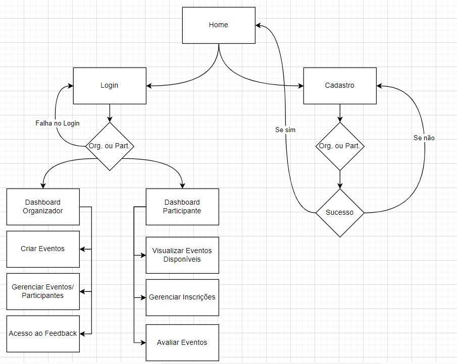
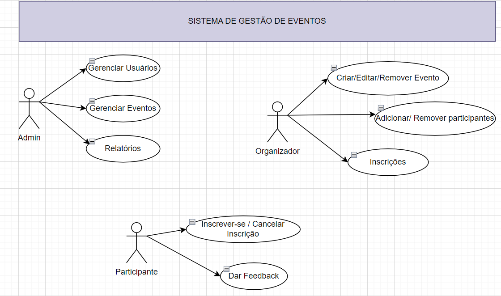
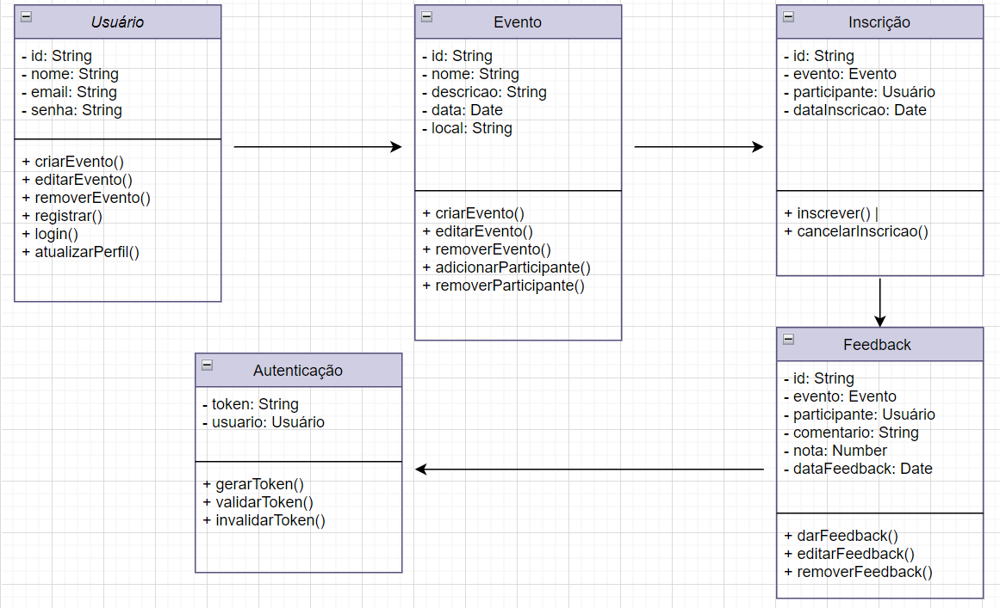
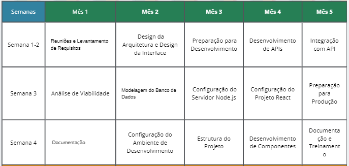
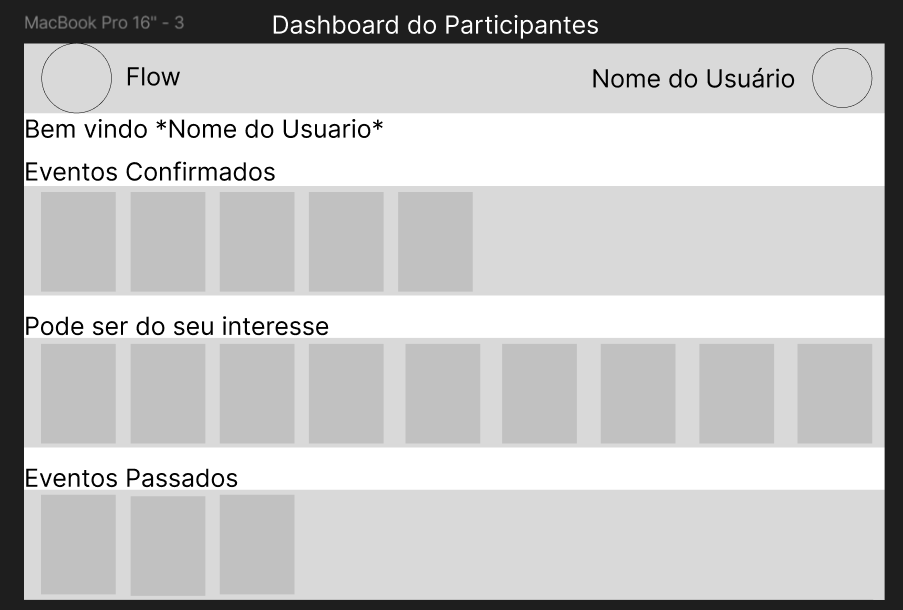
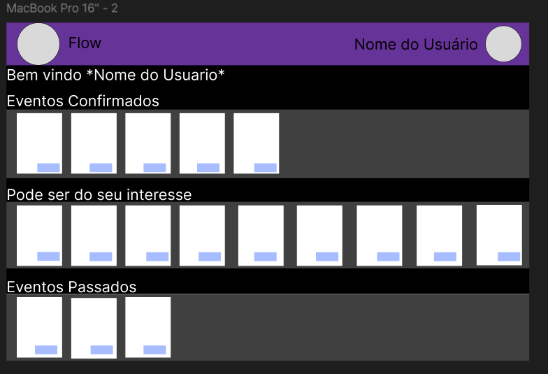
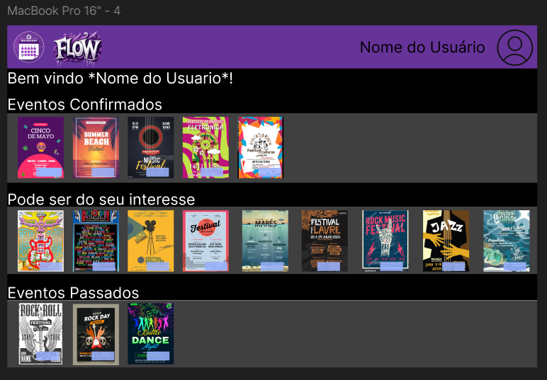

# ReactNode

## **Sistema de Gestão Flow**

### **Contexto do Projeto**
"O Sistema de Gestão de Eventos é uma aplicação prática voltada para o gerenciamento eficiente de eventos, aplicável a uma variedade de contextos, como pequenos eventos comunitários, conferências empresariais ou festivais de grande porte. Este projeto visa permitir a organização de eventos, com funcionalidades que englobam cadastro de participantes, gerenciamento de inscrições, notificações e avaliações pós-evento. Ele oferece a oportunidade de aplicar tecnologias modernas como **Node.js** para o backend, **React** no frontend, **MongoDB** para persistência de dados, além de autenticação e segurança com **JWT**."

---

## **Escopo do Projeto**

Desenvilver uma plataforma inovadora de gestão de eventos que permite aos organizadores criar, promover e gerenciar eventos de forma eficiente e intuitiva. A solução oferece funcionalidades para cadastro de usuários, criação e gerenciamento de eventos e inscrições, além de notificações e feedback dos participantes. Com uma interface moderna e fácil de usar, visando transformar a organização de eventos em uma experiência fluida e sem complicações.

### **Objetivos Gerais**
- Construir uma plataforma de gerenciamento de eventos que permita a criação, inscrição e avaliação de eventos de maneira eficiente.
- Integrar tecnologias modernas e escaláveis para garantir a performance e segurança da aplicação.
- Proporcionar uma experiência de usuário intuitiva e acessível, tanto para organizadores quanto para participantes.

### **Objetivos Específicos**
- Implementar um sistema de cadastro e autenticação de usuários com níveis de permissão diferenciados (organizadores e participantes).
- Permitir a criação e edição de eventos por organizadores, com opções de personalização (datas, horários, local, descrição).
- Oferecer aos participantes a funcionalidade de inscrição em eventos e notificações de atualizações.
- Incluir uma funcionalidade de avaliação de eventos, permitindo feedback dos participantes.

### **Objetivos Mensuráveis**
- **Meta de Usuários**: Alcançar 1.000 usuários cadastrados nos primeiros 6 meses após o lançamento.
- **Meta de Eventos**: Ter ao menos 200 eventos cadastrados no primeiro ano.
- **Meta de Avaliação**: Obter uma avaliação média de 4 estrelas ou mais dos participantes no primeiro ano de uso.
- **Desempenho**: Garantir que as principais páginas da aplicação carreguem em menos de 3 segundos.
- **Taxa de Conversão**: Conseguir que 50% dos visitantes do site se inscrevam em pelo menos um evento.

### **Objetivos Atingíveis**
- Utilizar tecnologias amplamente adotadas e de alta performance, como **Node.js**, **React** e **MongoDB**, garantindo uma base sólida e escalável.
- Focar na metodologia **MVP** para permitir lançamentos rápidos e adições incrementais de funcionalidades.
- Manter um planejamento ágil, priorizando entregas rápidas e ciclos curtos de desenvolvimento, para que melhorias e funcionalidades sejam entregues progressivamente.

### **Objetivos Relevantes**
- Proporcionar uma plataforma moderna e eficiente que atenda às necessidades de organizadores de eventos e seus participantes.
- Facilitar a criação de eventos e o engajamento de uma comunidade ativa, promovendo uma experiência fluida e confiável para os usuários.
- Contribuir para a automação de processos que hoje são manuais, reduzindo o tempo e esforço para organizar e participar de eventos.

### **Objetivos Temporais**
- **Fase 1 (Mês 1 a 2)**: 
    - Definição do escopo detalhado.
    - Estruturação do banco de dados no MongoDB.
    - Desenvolvimento do backend (API RESTful em Node.js com Express).
    - Protótipos iniciais do frontend em React.
- **Fase 2 (Mês 3 a 4)**: 
    - Implementação das principais funcionalidades: cadastro de eventos, sistema de autenticação JWT, inscrição de participantes.
    - Integração completa entre frontend e backend.
    - Início dos testes de unidade e integração.
- **Fase 3 (Mês 5)**: 
    - Implementação de funcionalidades avançadas: notificações, sistema de avaliações, favoritos.
    - Testes de carga e otimizações de performance.
    - Lançamento da versão MVP e ajustes pós-lançamento.

---

## **Análise de Riscos**

### **Problemas Potenciais e Soluções**

- **Baixa Adoção Inicial**
    - **Impacto**: Dificuldade em atrair usuários e criar uma base sólida de organizadores e participantes.
    - **Soluções**: Ações de marketing digital, parcerias com organizadores de eventos, promoções para novos usuários e incentivos como descontos ou brindes.
  
- **Sobrecarga do Servidor**
    - **Impacto**: Se o sistema crescer rapidamente, pode enfrentar problemas de performance.
    - **Soluções**: Escalabilidade vertical e horizontal com uso de serviços de cloud computing (AWS, Heroku), uso de cache (Redis) e otimização de consultas no banco de dados.
  
- **Vulnerabilidades de Segurança**
    - **Impacto**: A aplicação pode sofrer ataques como SQL injection, XSS ou falhas de autenticação, comprometendo dados sensíveis.
    - **Soluções**: Implementar medidas como validação de entrada, criptografia com bcrypt para senhas, autenticação via JWT e cabeçalhos seguros com Helmet.js.
  
- **Bugs e Problemas Técnicos**
    - **Impacto**: Erros e falhas técnicas podem afetar a experiência do usuário e a confiabilidade do sistema.
    - **Soluções**: Adoção de testes rigorosos (unitários, de integração e E2E) e uso de CI/CD para deploys mais seguros e ágeis.

---

## **Desenvolvimento**

**Fluxograma**

**Diagrama de Uso**

**Diagrama de Classes**

---

## **Cronograma**

---

## **Recursos**

### **Recursos Tecnológicos**
- **Frameworks/Linguagens**: Node.js, Express, React.js, MongoDB, JavaScript/TypeScript.
- **Infraestrutura**: AWS ou Heroku para hospedagem, AWS S3 para armazenamento de arquivos.
- **Ferramentas de Desenvolvimento**: Git/GitHub, Docker, CI/CD.
- **Segurança**: Autenticação com JWT, criptografia com bcrypt, Helmet.js.

### **Recursos Humanos**
- **Desenvolvedores Backend**: Especialistas em Node.js, com experiência em API RESTful e MongoDB.
- **Desenvolvedores Frontend**: Especialistas em React.js, focados em design responsivo.
- **Designer UI/UX**: Criará uma interface amigável e intuitiva.
- **QA**: Testes rigorosos para garantir a estabilidade do sistema.
- **Equipe de Marketing**: Divulgará a plataforma e atraíra os usuários iniciais.

---

### **Prototipagem da Dashboard de Usuários**

**Baixa Fidelidade**

**Média Fidelidade**

**Alta Fidelidade**

